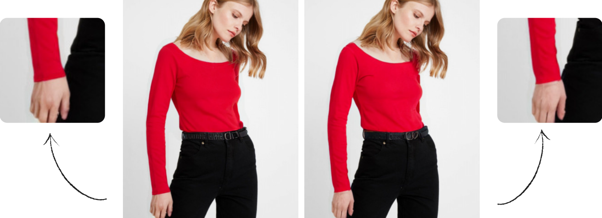
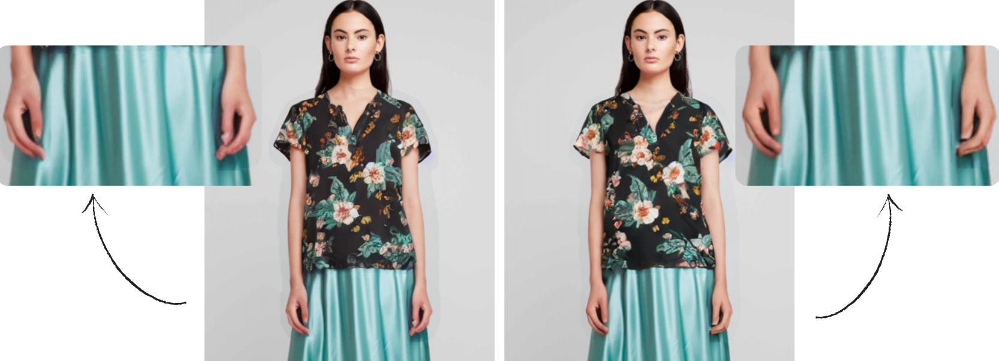
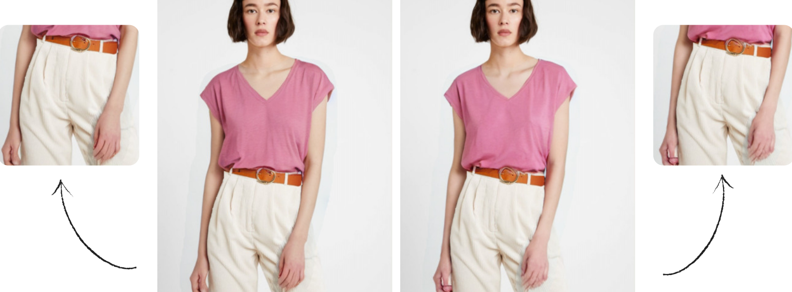
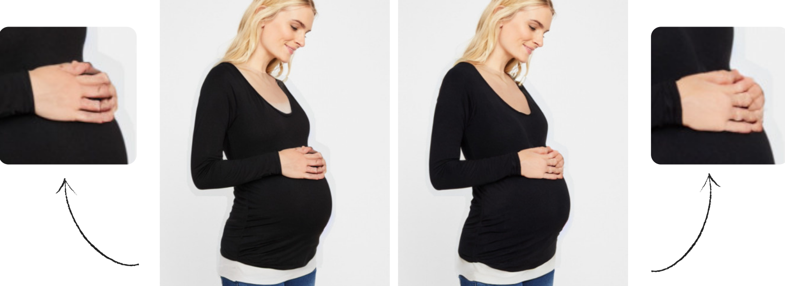

# DCI-VTON-with-Integrated-LoRA-Support-for-Hand-Adjustment-Enhancement 

**Abstract:** 
The ever-evolving world of virtual trials is quite intriguing for those who follow technology. This project builds upon the existing DCI-VTON model by introducing several improvements. While successfully aligning the clothing, distortions were observed in the hands. We aimed to observe improvement by integrating our own solution method to this problem.

It was not necessary to retrain the entire model from scratch for the abnormalities detected in the hands. Training was performed by focusing on a small area using LoRA, one of the fine-tuning methods. The project was developed by integrating this method.


<details>
<summary><h2>DCI-VTON Installation</h2></summary>


### Installation
#### Diffusion Model
1. Clone the repository
```shell
cd ./Documents/
git clone https://github.com/bcmi/DCI-VTON-Virtual-Try-On.git
cd DCI-VTON-Virtual-Try-On
```
2. Install Python dependencies
```shell
conda env create -f environment.yaml
conda activate dci-vton
```
3. Download the pretrained [vgg](https://drive.google.com/file/d/1rvow8jStPt8t2prDcSRlnf8yzXhrYeGo/view?usp=sharing) checkpoint and put it in `models/vgg/`
#### Warping Module
4. Clone the PF-AFN repository
```shell
git clone https://github.com/geyuying/PF-AFN.git
```
5. Move the code to the corresponding directory
```shell
cp -r DCI-VTON-Virtual-Try-On/warp/train/* PF-AFN/PF-AFN_train/
cp -r DCI-VTON-Virtual-Try-On/warp/test/* PF-AFN/PF-AFN_test/
```
### Data Preparation
#### VITON-HD
1. Download [VITON-HD](https://github.com/shadow2496/VITON-HD) dataset **(We downloaded it from this link - [VITON-HD-Kaggle](https://www.kaggle.com/datasets/marquis03/high-resolution-viton-zalando-dataset))**
2. Download pre-warped cloth image/mask from [Google Drive](https://drive.google.com/drive/folders/15cBiA0AoSCLSkg3ueNFWSw4IU3TdfXbO?usp=sharing) or [Baidu Cloud](https://pan.baidu.com/s/1ss8e_Fp3ZHd6Cn2JjIy-YQ?pwd=x2k9) and put it under your VITON-HD dataset


After these, the folder structure should look like this (the unpaired-cloth* only included in test directory):
```
├── VITON-HD
|   ├── test_pairs.txt
|   ├── train_pairs.txt
│   ├── [train | test]
|   |   ├── image
│   │   │   ├── [000006_00.jpg | 000008_00.jpg | ...]
│   │   ├── cloth
│   │   │   ├── [000006_00.jpg | 000008_00.jpg | ...]
│   │   ├── cloth-mask
│   │   │   ├── [000006_00.jpg | 000008_00.jpg | ...]
│   │   ├── cloth-warp
│   │   │   ├── [000006_00.jpg | 000008_00.jpg | ...]
│   │   ├── cloth-warp-mask
│   │   │   ├── [000006_00.jpg | 000008_00.jpg | ...]
│   │   ├── unpaired-cloth-warp
│   │   │   ├── [000006_00.jpg | 000008_00.jpg | ...]
│   │   ├── unpaired-cloth-warp-mask
│   │   │   ├── [000006_00.jpg | 000008_00.jpg | ...]
```
### Inference
#### VITON-HD
Please download the pretrained model from [Google Drive](https://drive.google.com/drive/folders/11BJo59iXVu2_NknKMbN0jKtFV06HTn5K?usp=sharing) or [Baidu Cloud](https://pan.baidu.com/s/13Rp_-Fbp1NUN41q0U6S4gw?pwd=6bfg).
###### Warping Module
To test the warping module, first move the `warp_viton.pth` to `checkpoints` directory:
```shell
mv warp_viton.pth PF-AFN/PF-AFN_test/checkpoints
```
Then run the following command:
```shell
cd PF-AFN/PF-AFN_test
sh test_VITON.sh
```
After inference, you can put the results in the VITON-HD for inference and training of the diffusion model.
###### Diffusion Model
To quickly test our diffusion model, run the following command:
```shell
python test.py --plms --gpu_id 0 \
--ddim_steps 100 \
--outdir results/viton \
--config configs/viton512.yaml \
--ckpt /CHECKPOINT_PATH/viton512.ckpt \
--dataroot /DATASET_PATH/ \
--n_samples 8 \
--seed 23 \
--scale 1 \
--H 512 \
--W 512 \
--unpaired
```
or just simply run:
```shell
sh test.sh
```
### Training
#### Warping Module
To train the warping module, just run following commands:
```shell
cd PF-AFN/PF-AFN_train/
sh train_VITON.sh
```
#### Diffusion Model
We utilize the pretrained Paint-by-Example as initialization, please download the pretrained models from [Google Drive](https://drive.google.com/file/d/15QzaTWsvZonJcXsNv-ilMRCYaQLhzR_i/view) and save the model to directory `checkpoints`.


To train a new model on VITON-HD, you should first modify the dataroot of VITON-HD dataset in `configs/viton512.yaml` and then use `main.py` for training. For example,
```shell
python -u main.py \
--logdir models/dci-vton \
--pretrained_model checkpoints/model.ckpt \
--base configs/viton512.yaml \
--scale_lr False
```
or simply run:
```shell
sh train.sh
```
## Acknowledgements
Our code is heavily borrowed from [Paint-by-Example](https://github.com/Fantasy-Studio/Paint-by-Example). We also thank [PF-AFN](https://github.com/geyuying/PF-AFN), our warping module depends on it.

## Citation
```
@inproceedings{gou2023taming,
  title={Taming the Power of Diffusion Models for High-Quality Virtual Try-On with Appearance Flow},
  author={Gou, Junhong and Sun, Siyu and Zhang, Jianfu and Si, Jianlou and Qian, Chen and Zhang, Liqing},
  booktitle={Proceedings of the 31st ACM International Conference on Multimedia},
  year={2023}
}
```
</details>

<details>
<summary><h2>LoRA Preparation</h2></summary>

1. First, create a new set of models with clearly visible hands from the VITON-HD dataset. You can use the little_dataset_creation.py script for this.
    ```shell
    cd ./Documents/DCI-VTON-Virtual-Try-On/scripts
    python little_dataset_creation.py
    ```

    Apply this script to the following 5:
    ```
    image/
    openpose_json/
    image-parse-v3/   
    image-densepose/
    agnostic-mask/
    ```

    After these, the folder structure should look like this
    ```
    ./little_dataset/
    ├── agnostic-mask/
    ├── openpose.json/
    ├── image/
    ├── image-densepose/
    └── image-parse-v3/
    ```


2. After creating the data set, we create the hand masks of the models.You can use the hand_mask_creation.py script for this. 

    ```shell
    cd DCI-VTON-Virtual-Try-On/scripts
    python hand_mask_creation.py
    ```

3. After creating the venv virtual environment, activate it. Install the Kohya_ss training framework and make sure it contains the sd-scripts folder. You can do all this by following the instructions below.

    ```
    cd ~/Documents/
    python3 -m venv kohya_env 
    source kohya_env/bin/activate # Activate virtual environment

    git clone https://github.com/bmaltais/kohya_ss 
    cd kohya_ss
    git clone https://github.com/kohya-ss/sd-scripts.git
    pip install -r requirements.txt
    ```
</details>

<details>
<summary><h2>LoRA Training</h2></summary>

For the training phase, first make sure you are in the kohya_ss directory in your terminal. Then, run the train_network.py script located in the sd-scripts folder (or in the root directory of kohya_ss), adjusting the parameters below according to your own dataset.

In this step, you need to create a folder named img. Inside it, create another folder containing the original model images and name it {step-count}_hands. The train_data_dir parameter should be set to the path of the img folder. Otherwise, you may get errors ahead.

```
python sd-scripts/train_network.py \ --pretrained_model_name_or_path="runwayml/stable-diffusion-v1-5" \ --train_data_dir="Path For Your Own Training Data Folder" \ --output_dir="Path For Your Own Output Folder" \ 
--resolution=512 \ 
--network_dim=64 \ 
--network_alpha=32 \ 
--batch_size=4 \ 
--max_train_steps=1500 \ 
--save_every_n_epochs=100 \ 
--mixed_precision=fp16 \ 
--xformers \ 
--gradient_checkpointing \ 
—-gradient_accumulation_steps=4 \ 
–-network_module=networks.lora \ 
–-enable_bucket
```

After the training phase, verify that weights with the .safetensors extension have been created and run the infer.py file for inference, adjusting the parameters below according to your data. (Make sure you are in the correct directory.)

```
PYTHONPATH=$PWD python infer.py \ 
--config "$PWD/configs/viton512.yaml" \ 
--input_dir "*The Folder With Original Images*" \ 
--output_dir "*Folder Path For The Inference Results*" \ 
--checkpoint "$PWD/ldm/models/checkpoints/viton512_v2.ckpt" \ --lora_scale 0.8 \ 
--hand_correction True \ 
--hand_mask_dir "*Your Path To Hand Masks Directory*"
```

**You've completed all the preparations! Now it's time to see the results. Update the directory paths in test.py from the original project to match your setup, and run it. The results are waiting for you in the result folder!** 

```shell
python test.py --plms --gpu_id 0 \
--ddim_steps 100 \ #Exp 10
--outdir results/viton \
--config configs/viton512.yaml \
--ckpt /CHECKPOINT_PATH/viton512.ckpt \
--dataroot /DATASET_PATH/ \
--n_samples 8 \ #Exp 1 or 2
--seed 23 \
--scale 1 \
--H 512 \
--W 512 \
--unpaired
```
</details>


<details>
<summary><h2>Results and Discussion</h2></summary>

In the DCI-VTON project, which features strong alignment capabilities, our focus on hand enhancement was successfully implemented through all stages of the pipeline. However, due to hardware limitations, our training machine was not sufficient, resulting in moderate performance (approximately 50% success rate). The training was conducted on a small dataset of 385 samples. The number of steps was set to the maximum capacity our machine could handle, which was 6000 steps in our case.
To achieve better results, performance can be improved by expanding the dataset and increasing the number of training steps. Since the training was performed on a small region, the ideal dataset size would be around 1000–2000 samples. The number of epochs should also be adjusted based on the dataset size to avoid underfitting or overfitting.

A few examples of the results we obtained are given below. The left side displays the original DCI-VTON output, whereas the right side shows the output generated by the LoRA-integrated DCI-VTON model.





